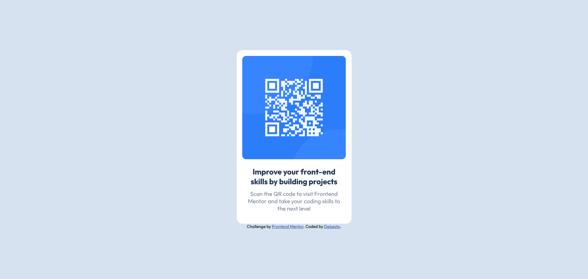

# Frontend Mentor - QR code component solution

This is a solution to the [QR code component challenge on Frontend Mentor](https://www.frontendmentor.io/challenges/qr-code-component-iux_sIO_H). Frontend Mentor challenges help you improve your coding skills by building realistic projects.

## Table of contents

- [Overview](#overview)
  - [Screenshot](#screenshot)
- [My process](#my-process)
  - [Built with](#built-with)
  - [What I learned](#what-i-learned)
  - [Continued development](#continued-development)
- [Author](#author)

## Overview

### Screenshot



## My process

### Built with

- Semantic HTML5 markup
- SCSS custom properties
- Flexbox

### What I learned

First time I really see how paddings nad margins works together.

```scss
.qr-code {
	width: 270px;
	margin: 15px 0px 20px;
	border-radius: 10px;
}
h1 {
	padding: 0 20px;
	margin-bottom: 10px;
	font-size: 20px;
	color: $dark-blue;
}
p {
	padding: 0 20px;
	margin-bottom: 30px;
	font-size: 15px;
	color: $grayish-blue;
}
```

### Continued development

I need to focus on paddings and margins.

## Author

- GitHub - [@Debesta](https://github.com/Debesta)
- Frontend Mentor - [@Debesta](https://www.frontendmentor.io/profile/Debesta)
